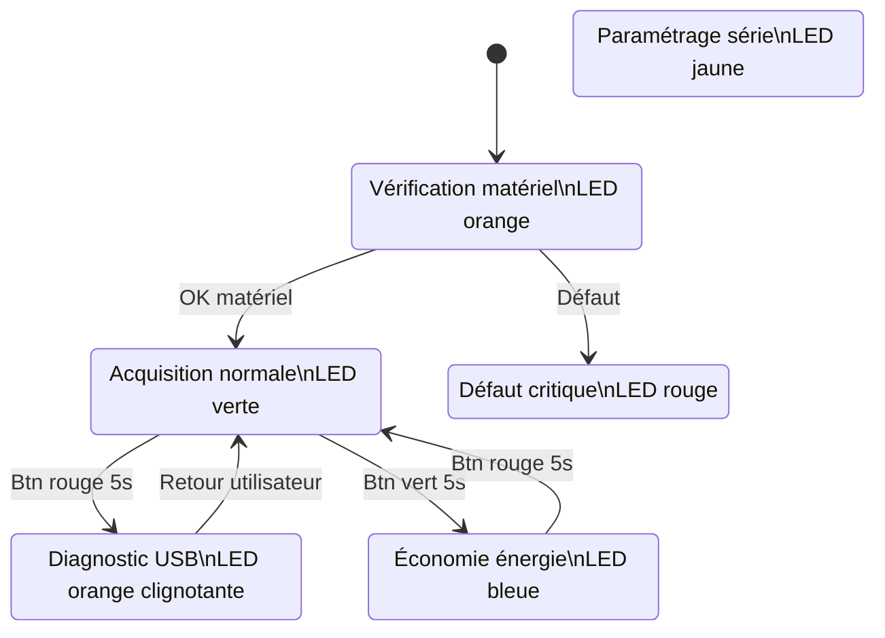

# Worldwide Weather Watcher — Prototype V1

Livrable 2 — Architecture Logicielle et Fonctionnelle


- Microcontrôleur : Seeeduino Lotus (ATmega328P)
- Capteurs : Grove + GPS + Carte SD
- Architecture : Firmware événementiel non bloquant
- Auteurs: ANDRIANARISATA Tsiky; LANDRIER Quentin; LALINNE Robin; BARAKAT Helena


# 1. Philosophie Logicielle

Le firmware repose sur une architecture non bloquante.

Aucune utilisation de `delay()` afin de permettre :

- Lecture GPS continue (NMEA 9600 bauds)
- Détection d'appuis longs (>5s)
- Gestion simultanée des LEDs d’état
- Écriture sécurisée sur carte SD

Le système est piloté par une Machine à États Finis (FSM).


# 2. Machine à États (Modes système)




# 3. Algorithme Principal

Architecture coopérative temps réel.


# 4. Gestion des Fichiers SD

## Format des logs

```
AAMMJJ_R.LOG
```

Exemple :

```
260213_0.LOG
```

### Rotation automatique

- écriture dans `_0.LOG`
- dépassement taille → renommage `_1.LOG`
- nouveau fichier créé


# 5. Diagnostic LED (Codes erreurs)

```mermaid
gantt
    %%{init: { 'theme': 'base', 'themeVariables': {
        'critBkgColor': '#ff0000',
        'activeTaskBkgColor': '#0000ff',
        'doneTaskBkgColor': '#00ff00',
        'sectionBkgColor': '#ffffff',
        'sectionBkgColor2': '#f4f4f4'
    }}}%%
    title Séquences LED (Correction GitHub)
    dateFormat X
    axisFormat %s

    section RTC HS
    Rouge :crit, 0, 1
    Bleu  :active, 1, 2

    section Capteur HS
    Rouge :crit, 0, 1
    Vert  :done, 1, 2

    section SD Pleine
    Rouge :crit, 0, 1
    Blanc : 1, 2
```



# 6. Paramètres Configurables
| Paramètre      | Domaine       | Défaut  | Description                                                                 |
|----------------|---------------|---------|-----------------------------------------------------------------------------|
| LUMIN          | {0, 1}        | 1       | Activation (1) / Désactivation (0) du capteur de luminosité.               |
| LUMIN_LOW      | 0-1023        | 255     | Seuil en dessous duquel la luminosité est considérée comme "faible".       |
| LUMIN_HIGH     | 0-1023        | 768     | Seuil au-dessus duquel la luminosité est considérée comme "forte".         |
| TEMP_AIR       | {0, 1}        | 1       | Activation (1) / Désactivation (0) du capteur de température.              |
| MIN_TEMP_AIR   | -40-85        | -10     | Seuil T° (°C) en dessous duquel le capteur se met en erreur.               |
| MAX_TEMP_AIR   | -40-85        | 60      | Seuil T° (°C) au-dessus duquel le capteur se met en erreur.                |
| HYGR           | {0, 1}        | 1       | Activation (1) / Désactivation (0) du capteur d'hygrométrie.               |
| HYGR_MINT      | -40-85        | 0       | T° en dessous de laquelle les mesures d'hygrométrie sont ignorées.          |
| HYGR_MAXT      | -40-85        | 50      | T° au-dessus de laquelle les mesures d'hygrométrie sont ignorées.           |
| PRESSURE       | {0, 1}        | 1       | Activation (1) / Désactivation (0) du capteur de pression.                 |
| PRESSURE_MIN   | 300-1100      | 850     | Seuil Pression (hPa) en dessous duquel le capteur se met en erreur.        |
| PRESSURE_MAX   | 300-1100      | 1080    | Seuil Pression (hPa) au-dessus duquel le capteur se met en erreur.         |
| LOG_INTERVAL   | -             | 10 min  | Intervalle entre deux mesures (Paramètre système standard).                 |
| FILE_MAX_SIZE  | -             | 2048    | Taille maximale d'un fichier de log (octets).                               |
| TIMEOUT        | -             | 30 s    | Temps max d'attente réponse capteur.                                        |


Architecture Firmware
flowchart LR


    APP[Application FSM]
    DRIVERS[Drivers Capteurs]
    HAL[HAL Microcontrôleur]
    HW[Hardware ATmega328P]

    APP --> DRIVERS
    DRIVERS --> HAL
    HAL --> HW


Objectifs Techniques
Firmware non bloquant
Acquisition multi-capteurs
Gestion énergétique
Diagnostic terrain
Intégrité des données


