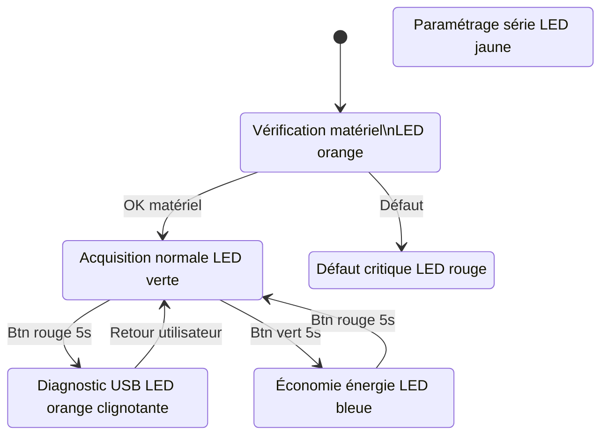
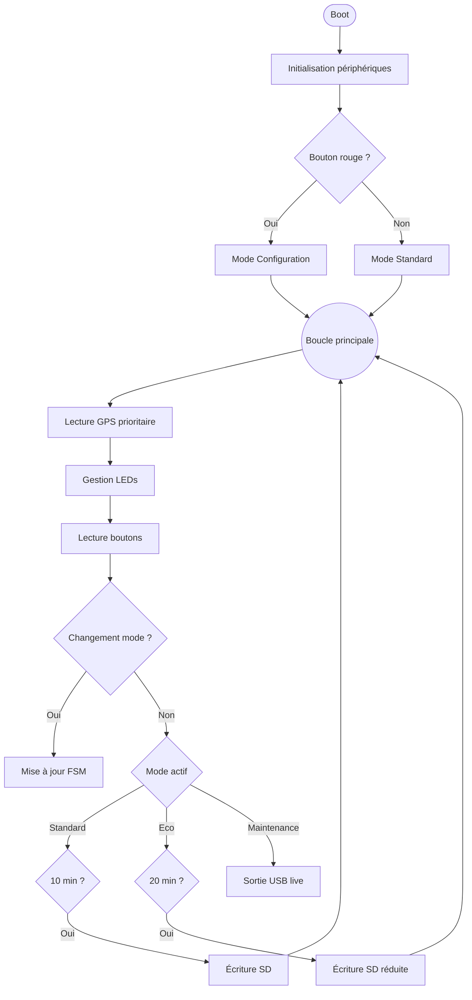
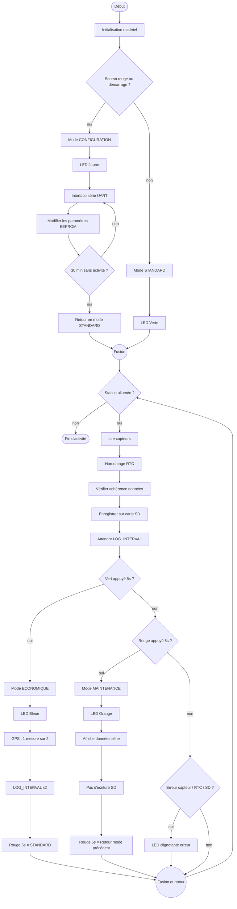

# Worldwide Weather Watcher — Prototype V1

Livrable 2 — Architecture Logicielle et Fonctionnelle

Système embarqué de surveillance météorologique autonome.

- Microcontrôleur : Seeeduino Lotus (ATmega328P)
- Capteurs : Grove + GPS + Carte SD
- Architecture : Firmware événementiel non bloquant
- Date : 13 Février 2026

---

# 1. Philosophie Logicielle

Le firmware repose sur une architecture non bloquante.

Aucune utilisation de `delay()` afin de permettre :

- Lecture GPS continue (NMEA 9600 bauds)
- Détection d'appuis longs (>5s)
- Gestion simultanée des LEDs d’état
- Écriture sécurisée sur carte SD

Le système est piloté par une Machine à États Finis (FSM).

---

# 2. Machine à États (Modes système)



---

# 3. Algorithme Principal

Architecture coopérative temps réel.




# 4.Diagramme d’activité



---

# 5. Gestion des Fichiers SD

## Format des logs

```
AAMMJJ_R.LOG
```

Exemple :

```
260213_0.LOG
```

### Rotation automatique

- écriture dans `_0.LOG`
- dépassement taille → renommage `_1.LOG`
- nouveau fichier créé

---

# 6. Diagnostic LED (Codes erreurs)

```mermaid
gantt
    title Séquences LED (visualisation normalisée)
    dateFormat X
    axisFormat %s

    section RTC HS
    Rouge :crit, 0, 1
    Bleu  :active, 1, 1

    section GPS HS
    Rouge :crit, 0, 1
    Jaune :active, 1, 1

    section Capteur HS
    Rouge :crit, 0, 1
    Vert  :active, 1, 1

    section SD Pleine
    Rouge :crit, 0, 1
    Blanc :active, 1, 1

    section Accès SD
    Rouge court :crit, 0, 1
    Blanc long  :active, 1, 2
```



---

# 7. Paramètres Configurables

| Paramètre | Valeur |
|---|---|
| MIN_TEMP_AIR | -10°C |
| MAX_TEMP_AIR | 60°C |
| PRESSURE_MIN | 850 hPa |
| PRESSURE_MAX | 1080 hPa |
| LOG_INTERVAL | 10 min |

---

# 8. Architecture Firmware


---

# 9. Objectifs Techniques

- Firmware non bloquant
- Acquisition multi-capteurs
- Gestion énergétique
- Diagnostic terrain
- Intégrité des données

---

# Licence

Projet éducatif — utilisation libre pour apprentissage.
