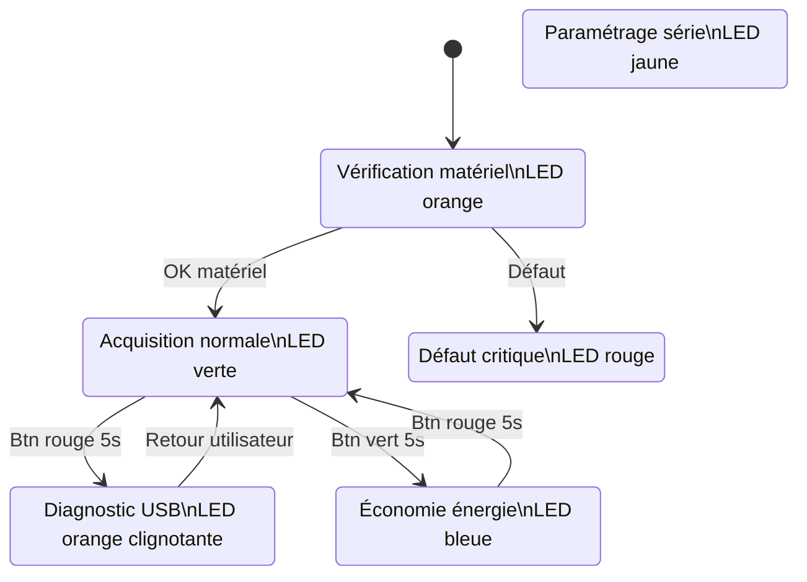

# Worldwide Weather Watcher — Prototype V1

Livrable 2 — Architecture Logicielle et Fonctionnelle


- Microcontrôleur : Seeeduino Lotus (ATmega328P)
- Capteurs : Grove + GPS + Carte SD
- Architecture : Firmware événementiel non bloquant
- Auteurs: ANDRIANARISATA Tsiky; LANDRIER Quentin; LALINNE Robin; BARAKAT Helena


# 1. Philosophie Logicielle

Le firmware repose sur une architecture non bloquante.

Aucune utilisation de `delay()` afin de permettre :

- Lecture GPS continue (NMEA 9600 bauds)
- Détection d'appuis longs (>5s)
- Gestion simultanée des LEDs d’état
- Écriture sécurisée sur carte SD

Le système est piloté par une Machine à États Finis (FSM).


# 2. Machine à États (Modes système)




# 3. Algorithme Principal

Architecture coopérative temps réel.


# 4. Gestion des Fichiers SD

## Format des logs

```
AAMMJJ_R.LOG
```

Exemple :

```
260213_0.LOG
```

### Rotation automatique

- écriture dans `_0.LOG`
- dépassement taille → renommage `_1.LOG`
- nouveau fichier créé


# 5. Diagnostic LED (Codes erreurs)

```mermaid
gantt
    %%{init: { 'theme': 'base', 'themeVariables': {
        'critBkgColor': '#ff0000',
        'activeTaskBkgColor': '#0000ff',
        'doneTaskBkgColor': '#00ff00',
        'sectionBkgColor': '#ffffff',
        'sectionBkgColor2': '#f4f4f4'
    }}}%%
    title Séquences LED (Correction GitHub)
    dateFormat X
    axisFormat %s

    section RTC HS
    Rouge :crit, 0, 1
    Bleu  :active, 1, 2

    section Capteur HS
    Rouge :crit, 0, 1
    Vert  :done, 1, 2

    section SD Pleine
    Rouge :crit, 0, 1
    Blanc : 1, 2
```



# 6. Paramètres Configurables
| Paramètre      | Domaine       | Défaut  | Description                                                                 |
|----------------|---------------|---------|-----------------------------------------------------------------------------|
| LUMIN          | {0, 1}        | 1       | Activation (1) / Désactivation (0) du capteur de luminosité.               |
| LUMIN_LOW      | 0-1023        | 255     | Seuil en dessous duquel la luminosité est considérée comme "faible".       |
| LUMIN_HIGH     | 0-1023        | 768     | Seuil au-dessus duquel la luminosité est considérée comme "forte".         |
| TEMP_AIR       | {0, 1}        | 1       | Activation (1) / Désactivation (0) du capteur de température.              |
| MIN_TEMP_AIR   | -40-85        | -10     | Seuil T° (°C) en dessous duquel le capteur se met en erreur.               |
| MAX_TEMP_AIR   | -40-85        | 60      | Seuil T° (°C) au-dessus duquel le capteur se met en erreur.                |
| HYGR           | {0, 1}        | 1       | Activation (1) / Désactivation (0) du capteur d'hygrométrie.               |
| HYGR_MINT      | -40-85        | 0       | T° en dessous de laquelle les mesures d'hygrométrie sont ignorées.          |
| HYGR_MAXT      | -40-85        | 50      | T° au-dessus de laquelle les mesures d'hygrométrie sont ignorées.           |
| PRESSURE       | {0, 1}        | 1       | Activation (1) / Désactivation (0) du capteur de pression.                 |
| PRESSURE_MIN   | 300-1100      | 850     | Seuil Pression (hPa) en dessous duquel le capteur se met en erreur.        |
| PRESSURE_MAX   | 300-1100      | 1080    | Seuil Pression (hPa) au-dessus duquel le capteur se met en erreur.         |
| LOG_INTERVAL   | -             | 10 min  | Intervalle entre deux mesures (Paramètre système standard).                 |
| FILE_MAX_SIZE  | -             | 2048    | Taille maximale d'un fichier de log (octets).                               |
| TIMEOUT        | -             | 30 s    | Temps max d'attente réponse capteur.                                        |


Architecture Firmware
flowchart LR


    APP[Application FSM]
    DRIVERS[Drivers Capteurs]
    HAL[HAL Microcontrôleur]
    HW[Hardware ATmega328P]

    APP --> DRIVERS
    DRIVERS --> HAL
    HAL --> HW


Objectifs Techniques
Firmware non bloquant
Acquisition multi-capteurs
Gestion énergétique
Diagnostic terrain
Intégrité des données

# 7. Pseudo-Code
```cpp

Entrées :
  - Paramètres EEPROM : LOG_INTERVAL, FILE_MAX_SIZE, TIMEOUT, (paramètres capteurs)
  - Capteurs : pression, température air, hygrométrie, luminosité, GPS
  - Modules : RTC, SD, LED, UART, boutons (rouge, vert)

Sorties :
  - Fichiers .LOG sur SD (lignes horodatées)
  - Affichage série (mode maintenance / configuration)
  - Signalisation LED (états & erreurs)


1  // Initialisation 
2  initialiser_bus(I2C, SPI, UART)
3  initialiser_modules(RTC, SD, LED)
4  initialiser_capteurs()
5
6  si accès_RTC_impossible alors signaler_LED(ERREUR_RTC)
7  si accès_SD_impossible  alors signaler_LED(ERREUR_SD)
8
9  si bouton_rouge_presse_au_demarrage alors
10     mode ← CONFIGURATION
11  sinon
12     mode ← STANDARD
13  fin si
14
15  mode_precedent ← STANDARD
16  compteur_cycle ← 0


17 // Boucle principale
18 tant que station_allumee faire

19    // Gestion LED par mode
20    si mode = STANDARD      alors LED ← VERTE_CONTINUE
21    si mode = CONFIGURATION alors LED ← JAUNE_CONTINUE
22    si mode = ECONOMIQUE    alors LED ← BLEUE_CONTINUE
23    si mode = MAINTENANCE   alors LED ← ORANGE_CONTINUE

24    // Détection événements boutons (appuis longs)
25    si appui_long(bouton_rouge, 5s) alors
26       si mode = MAINTENANCE alors
27          mode ← mode_precedent                 // retour au mode précédent
28       sinon si mode = ECONOMIQUE alors
29          mode ← STANDARD                       // en ECO, rouge 5s -> STANDARD
30       sinon
31          mode_precedent ← mode                 // STANDARD ou ECONOMIQUE -> MAINTENANCE
32          mode ← MAINTENANCE
33       fin si
34    fin si
35
36    si appui_long(bouton_vert, 5s) alors
37       si mode = STANDARD alors
38          mode ← ECONOMIQUE                     // ECO accessible uniquement depuis STANDARD
39       fin si
40    fin si


41    // Mode CONFIGURATION
42    si mode = CONFIGURATION alors
43       demarrer_timer_inactivite(30min)
44       tant que mode = CONFIGURATION faire
45          si commande_UART_disponible alors
46             executer_commande_configuration()   // LOG_INTERVAL, FILE_MAX_SIZE, TIMEOUT, seuils, CLOCK/DATE/DAY, RESET, VERSION...
47             reinitialiser_timer_inactivite()
48          fin si
49          si timer_inactivite_ecoule alors
50             mode ← STANDARD
51          fin si
52       fin tant que
53    fin si


54    // Mode MAINTENANCE
55    si mode = MAINTENANCE alors
56       // pas d’écriture SD, données consultables en direct via UART
57       mesures ← lire_capteurs_avec_timeout(TIMEOUT)
58       afficher_UART(mesures)
59       continuer   // retour au début de boucle (événements boutons gérés en haut)
60    fin si


61    //  Modes STANDARD / ECONOMIQUE : acquisition + log SD 
62    si mode = STANDARD ou mode = ECONOMIQUE alors

63       // Ajustement intervalle en mode économique
64       si mode = ECONOMIQUE alors
65          intervalle_effectif ← 2 × LOG_INTERVAL
66       sinon
67          intervalle_effectif ← LOG_INTERVAL
68       fin si

69       attendre(intervalle_effectif)

70       // Acquisition capteurs
71       mesures ← lire_capteurs_avec_timeout(TIMEOUT)
72       horodatage ← lire_RTC()

73       // Acquisition GPS : 1 mesure sur 2 en ECO
74       si mode = ECONOMIQUE alors
75          compteur_cycle ← compteur_cycle + 1
76          si compteur_cycle mod 2 = 0 alors
77             gps ← lire_GPS_avec_timeout(TIMEOUT)
78          sinon
79             gps ← "NA"
80          fin si
81       sinon
82          gps ← lire_GPS_avec_timeout(TIMEOUT)
83       fin si

84       // Construire ligne horodatée (une ligne = toutes mesures)
85       ligne ← formatter(horodatage, mesures, gps)

86       // Écriture SD avec gestion taille fichier + archivage
87       si SD_pleine alors signaler_LED(SD_PLEINE)
88       sinon si erreur_ecriture_SD alors signaler_LED(ERREUR_ECRITURE_SD)
89       sinon
90          ecrire_SD(ligne)
91          si taille_fichier_LOG() ≥ FILE_MAX_SIZE alors
92             archiver_fichier_LOG_revision()     // copie avec numéro de révision, puis reprise au début du fichier 0
93          fin si
94       fin si

95       // Gestion erreurs capteurs / GPS / RTC (LED clignotantes)
96       si erreur_RTC  alors signaler_LED(ERREUR_RTC)
97       si erreur_GPS  alors signaler_LED(ERREUR_GPS)
98       si erreur_capteur alors signaler_LED(ERREUR_CAPTEUR)

99    fin si

100 fin tant que

101 retourner

```


