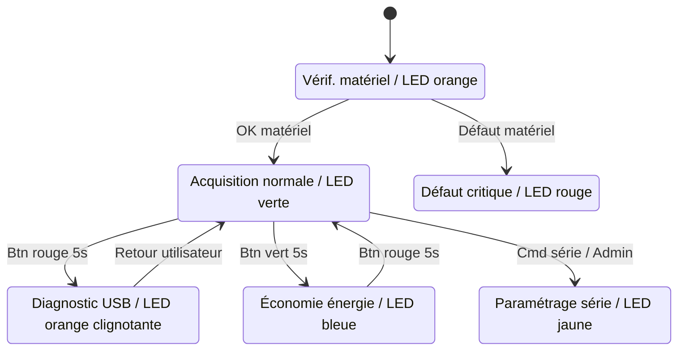
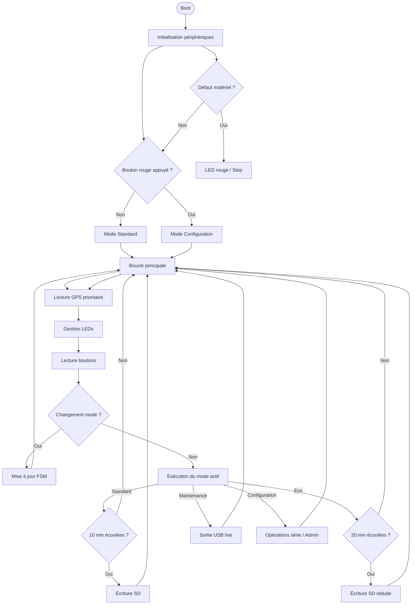

# Worldwide Weather Watcher — Prototype V1

Livrable 2 — Architecture Logicielle et Fonctionnelle


- Microcontrôleur : Seeeduino Lotus (ATmega328P)
- Capteurs : Grove + GPS + Carte SD
- Architecture : Firmware événementiel non bloquant
- Auteurs: ANDRIANARISATA Tsiky; LANDRIER Quentin; LALINNE Robin; BARAKAT Helena


# 1. Philosophie Logicielle

Le firmware repose sur une architecture non bloquante.

Aucune utilisation de `delay()` afin de permettre :

- Lecture GPS continue (NMEA 9600 bauds)
- Détection d'appuis longs (>5s)
- Gestion simultanée des LEDs d’état
- Écriture sécurisée sur carte SD

Le système est piloté par une Machine à États Finis (FSM).


# 2. Machine à États (Modes système)



# 3. Algorithme Principal

Architecture coopérative temps réel.




# 4. Gestion des Fichiers SD

## Format des logs

```
AAMMJJ_R.LOG
```

Exemple :

```
260213_0.LOG
```

### Rotation automatique

- écriture dans `_0.LOG`
- dépassement taille → renommage `_1.LOG`
- nouveau fichier créé


# 5. Diagnostic LED (Codes erreurs)

```mermaid
gantt
    %%{init: { 'theme': 'base', 'themeVariables': {
        'critBkgColor': '#ff0000',
        'doneTaskBkgColor': '#00ff00',
        'activeTaskBkgColor': '#0000ff',
        'taskBkgColor': '#ffffff'
    }}}%%
    title Signaux d'Erreur Lumineux (Cycles de 2 secondes)
    dateFormat  ss
    axisFormat  %S s

    section RTC HS
    Rouge (Erreur)      :crit, 00, 01
    Bleu (Horloge)      :active, 01, 02

    section Capteur HS
    Rouge (Erreur)      :crit, 00, 01
    Vert (Données)      :done, 01, 02

    section SD Pleine / HS
    Rouge (Erreur)      :crit, 00, 01
    Blanc (Stockage)    :01, 02
```



# 6. Paramètres Configurables
| Paramètre      | Domaine       | Défaut  | Description                                                                 |
|----------------|---------------|---------|-----------------------------------------------------------------------------|
| LUMIN          | {0, 1}        | 1       | Activation (1) / Désactivation (0) du capteur de luminosité.               |
| LUMIN_LOW      | 0-1023        | 255     | Seuil en dessous duquel la luminosité est considérée comme "faible".       |
| LUMIN_HIGH     | 0-1023        | 768     | Seuil au-dessus duquel la luminosité est considérée comme "forte".         |
| TEMP_AIR       | {0, 1}        | 1       | Activation (1) / Désactivation (0) du capteur de température.              |
| MIN_TEMP_AIR   | -40-85        | -10     | Seuil T° (°C) en dessous duquel le capteur se met en erreur.               |
| MAX_TEMP_AIR   | -40-85        | 60      | Seuil T° (°C) au-dessus duquel le capteur se met en erreur.                |
| HYGR           | {0, 1}        | 1       | Activation (1) / Désactivation (0) du capteur d'hygrométrie.               |
| HYGR_MINT      | -40-85        | 0       | T° en dessous de laquelle les mesures d'hygrométrie sont ignorées.          |
| HYGR_MAXT      | -40-85        | 50      | T° au-dessus de laquelle les mesures d'hygrométrie sont ignorées.           |
| PRESSURE       | {0, 1}        | 1       | Activation (1) / Désactivation (0) du capteur de pression.                 |
| PRESSURE_MIN   | 300-1100      | 850     | Seuil Pression (hPa) en dessous duquel le capteur se met en erreur.        |
| PRESSURE_MAX   | 300-1100      | 1080    | Seuil Pression (hPa) au-dessus duquel le capteur se met en erreur.         |
| LOG_INTERVAL   | -             | 10 min  | Intervalle entre deux mesures (Paramètre système standard).                 |
| FILE_MAX_SIZE  | -             | 2048    | Taille maximale d'un fichier de log (octets).                               |
| TIMEOUT        | -             | 30 s    | Temps max d'attente réponse capteur.                                        |


Architecture Firmware
flowchart LR


    APP[Application FSM]
    DRIVERS[Drivers Capteurs]
    HAL[HAL Microcontrôleur]
    HW[Hardware ATmega328P]

    APP --> DRIVERS
    DRIVERS --> HAL
    HAL --> HW


Objectifs Techniques
Firmware non bloquant
Acquisition multi-capteurs
Gestion énergétique
Diagnostic terrain
Intégrité des données

# 7. Pseudo-Code
## 1. Déclarations globales (Énumérations et Structures)

```cpp
// --- ÉNUMÉRATIONS (Pour les switch case) ---

[cite_start]// Les 4 modes de la station [cite: 481, 483, 485, 488]
enum ModeStation { STANDARD, CONFIGURATION, MAINTENANCE, ECONOMIQUE };

// Les événements possibles (matériels ou logiciels)
enum Evenement { AUCUN, BOUTON_ROUGE_DEMARRAGE, BOUTON_ROUGE_5S, BOUTON_VERT_5S, TIMER_ACQUISITION, TIMEOUT_CONFIG_30M, RECEPTION_UART };

[cite_start]// Les états de santé du système (incluant les erreurs matérielles) [cite: 492, 496, 497, 498, 499, 500]
enum EtatSysteme { 
    OK, 
    ERREUR_RTC,                 // Rouge/Bleu 
    ERREUR_GPS,                 // Rouge/Jaune 
    ERREUR_CAPTEUR_ACCES,       // Rouge/Vert (durées identiques)
    ERREUR_CAPTEUR_INCOHERENT,  // Rouge/Vert (Vert plus long)
    SD_PLEINE,                  // Rouge/Blanc (durées identiques)
    ERREUR_SD_ACCES             // Rouge/Blanc (Blanc plus long)
};

[cite_start]// Les commandes console (Mode Configuration) [cite: 520, 523, 524, 525, 529, 532, 535]
enum CommandeSerie { 
    INCONNUE, SET_LOG_INTERVAL, SET_FILE_MAX_SIZE, SET_TIMEOUT, 
    SET_LUMIN, SET_TEMP_AIR, SET_HYGR, SET_PRESSURE, 
    SET_CLOCK, SET_DATE, SET_DAY, CMD_RESET, CMD_VERSION 
};

// --- STRUCTURES DE DONNÉES ---

[cite_start]// Paramètres stockés en mémoire EEPROM [cite: 508, 513, 527, 529, 532]
struct ConfigurationSysteme {
    int logInterval;       // Par défaut 10 min
    int fileMaxSize;       // Par défaut 2048 octets
    int timeoutCapteur;    // Par défaut 30 sec
    
    int luminActif;        // 1 (activé) ou 0 (désactivé)
    int luminLow;
    int luminHigh;
    
    int tempAirActif;
    int minTempAir;
    int maxTempAir;
    
    int hygrActif;
    int hygrMinT;
    int hygrMaxT;
    
    int pressureActif;
    int pressureMin;
    int pressureMax;
};

// Données d'un cycle de mesure
struct MesuresMeteo {
    char horodatage[20];
    float temperature;   // Prendra la valeur "NA" en cas de timeout
    float pression;      
    float humidite;      
    int luminosite;      
    float latitude;
    float longitude;
};

// --- VARIABLES GLOBALES ---

ModeStation modeActuel = STANDARD;
ModeStation modePrecedent = STANDARD; [cite_start]// Utile pour le retour de maintenance [cite: 487]
Evenement eventActuel = AUCUN;
EtatSysteme etatGlobal = OK;

ConfigurationSysteme config;
MesuresMeteo dernieresMesures;
int compteurCycleEco = 0; [cite_start]// Pour la parité du GPS en mode éco [cite: 541]
```
## 2. Initialisation et Boucle Principale

```cpp
void setup() {
    initialiserMateriel();
    chargerConfigurationEEPROM(&config);

    [cite_start]// Détection du mode au démarrage [cite: 481, 483]
    Evenement eventDemarrage = lireBoutonRougeDemarrage();
    
    switch (eventDemarrage) {
        case BOUTON_ROUGE_DEMARRAGE:
            modeActuel = CONFIGURATION;
            allumerLED_Jaune(); [cite_start]// [cite: 492]
            demarrerMinuteurInactivite();
            break;
            
        case AUCUN:
        default:
            modeActuel = STANDARD;
            allumerLED_Verte(); [cite_start]// [cite: 492]
            demarrerTimerAcquisition(config.logInterval);
            break;
    }
}

void loop() {
    // 1. Écoute continue des événements matériels
    eventActuel = detecterEvenement(); 

    // 2. Aiguillage selon le mode en cours (Machine à états principale)
    switch (modeActuel) {
        case STANDARD:
            gererModeStandard(eventActuel);
            break;
            
        case ECONOMIQUE:
            gererModeEconomique(eventActuel);
            break;
            
        case MAINTENANCE:
            gererModeMaintenance(eventActuel);
            break;
            
        case CONFIGURATION:
            gererModeConfiguration(eventActuel);
            break;
    }
    
    // 3. Gestion globale des erreurs visuelles (indépendante du mode)
    afficherErreurLED(etatGlobal);
}
```
## 3. Fonctions de gestion des Modes (Les sous-machines à états)
```cpp
void gererModeStandard(Evenement event) {
    switch (event) {
        case TIMER_ACQUISITION:
            etatGlobal = acquerirHorodatage(&dernieresMesures);
            
            switch (etatGlobal) {
                case OK:
                    etatGlobal = acquerirTousCapteursActifs(&dernieresMesures, &config);
                    [cite_start]// Gestion de l'archivage SD (AAMMJJ_0.LOG) [cite: 514, 516]
                    verifierTailleEtArchiverFichierSD(config.fileMaxSize); 
                    etatGlobal = ecrireSurSD(dernieresMesures);
                    break;
            }
            break;

        case BOUTON_VERT_5S:
            [cite_start]// Passage en mode Économique [cite: 488, 489]
            modeActuel = ECONOMIQUE;
            compteurCycleEco = 0;
            allumerLED_Bleue(); [cite_start]// [cite: 492]
            demarrerTimerAcquisition(config.logInterval * 2); [cite_start]// [cite: 541]
            break;

        case BOUTON_ROUGE_5S:
            [cite_start]// Passage en mode Maintenance [cite: 485, 486]
            modePrecedent = STANDARD;
            modeActuel = MAINTENANCE;
            allumerLED_Orange(); [cite_start]// [cite: 492]
            arreterBusSPI(); [cite_start]// Sécurisation carte SD [cite: 485]
            break;

        case AUCUN:
        default:
            break;
    }
}

void gererModeEconomique(Evenement event) {
    switch (event) {
        case TIMER_ACQUISITION:
            // L'intervalle est déjà doublé
            acquerirHorodatage(&dernieresMesures);
            acquerirCapteursMeteoActifs(&dernieresMesures, &config);
            
            [cite_start]// Gestion de l'énergie GPS (1 cycle sur 2) [cite: 541]
            switch (compteurCycleEco % 2) {
                case 0: // Cycle Pair
                    acquerirGPS(&dernieresMesures);
                    memoriserDernierePosition(dernieresMesures);
                    break;
                case 1: // Cycle Impair
                    recupererDernierePosition(&dernieresMesures);
                    break;
            }
            compteurCycleEco++;
            
            ecrireSurSD(dernieresMesures);
            break;

        case BOUTON_ROUGE_5S:
            [cite_start]// Retour au Standard [cite: 490]
            modeActuel = STANDARD;
            allumerLED_Verte();
            demarrerTimerAcquisition(config.logInterval);
            break;
            
        case AUCUN:
        default:
            break;
    }
}

void gererModeMaintenance(Evenement event) {
    switch (event) {
        case TIMER_ACQUISITION:
            [cite_start]// Envoi des données en direct via UART (pas d'écriture SD) [cite: 538]
            acquerirTousCapteursActifs(&dernieresMesures, &config);
            envoyerDonneesConsoleSerie(dernieresMesures);
            break;

        case BOUTON_ROUGE_5S:
            [cite_start]// Sortie de maintenance et retour au mode précédent [cite: 487]
            reinitialiserCommunicationSD(); [cite_start]// [cite: 539]
            modeActuel = modePrecedent;
            
            switch (modeActuel) {
                case STANDARD:
                    allumerLED_Verte();
                    break;
                case ECONOMIQUE:
                    allumerLED_Bleue();
                    break;
            }
            break;
            
        case AUCUN:
        default:
            break;
    }
}

void gererModeConfiguration(Evenement event) {
    switch (event) {
        case RECEPTION_UART:
            resetMinuteurInactivite(); 
            CommandeSerie cmd = lireCommandeSerie();
            
            switch (cmd) {
                case SET_LOG_INTERVAL:
                case SET_FILE_MAX_SIZE:
                case SET_TIMEOUT:
                case SET_LUMIN:
                case SET_TEMP_AIR:
                    appliquerNouveauParametreEEPROM(&config);
                    envoyerMessageConsole("OK: Parametre mis a jour");
                    break;
                case SET_CLOCK:
                case SET_DATE:
                    mettreAJourRTC();
                    envoyerMessageConsole("OK: Horloge mise a jour");
                    break;
                case CMD_VERSION:
                    envoyerMessageConsole("V1.0 LOT ABC"); [cite_start]// [cite: 525]
                    break;
                case CMD_RESET:
                    reinitialiserParametresUsine(&config); [cite_start]// [cite: 524]
                    break;
                case INCONNUE:
                    envoyerMessageConsole("Syntax Error");
                    break;
            }
            break;

        case TIMEOUT_CONFIG_30M:
            [cite_start]// 30 min sans activité [cite: 484]
            modeActuel = STANDARD;
            allumerLED_Verte();
            demarrerTimerAcquisition(config.logInterval);
            break;
            
        case AUCUN:
        default:
            break;
    }
}
```
## 4. Fonction d'affichage des erreurs (Détachée pour la clarté)
```cpp
void afficherErreurLED(EtatSysteme etat) {
    switch (etat) {
        case OK:
            // La LED garde sa couleur de mode (Verte, Bleue, etc.)
            break;
        case ERREUR_RTC:
            allumerLED_Clignotante(ROUGE_BLEU, 50, 50); [cite_start]// [cite: 492]
            break;
        case ERREUR_GPS:
            allumerLED_Clignotante(ROUGE_JAUNE, 50, 50); [cite_start]// [cite: 496]
            break;
        case ERREUR_CAPTEUR_ACCES:
            allumerLED_Clignotante(ROUGE_VERT, 50, 50); [cite_start]// [cite: 497]
            break;
        case ERREUR_CAPTEUR_INCOHERENT:
            allumerLED_Clignotante(ROUGE_VERT, 33, 66); [cite_start]// Vert 2x plus long [cite: 498]
            break;
        case SD_PLEINE:
            allumerLED_Clignotante(ROUGE_BLANC, 50, 50); [cite_start]// [cite: 499]
            break;
        case ERREUR_SD_ACCES:
            allumerLED_Clignotante(ROUGE_BLANC, 33, 66); [cite_start]// Blanc 2x plus long [cite: 500]
            break;
    }
}
```


