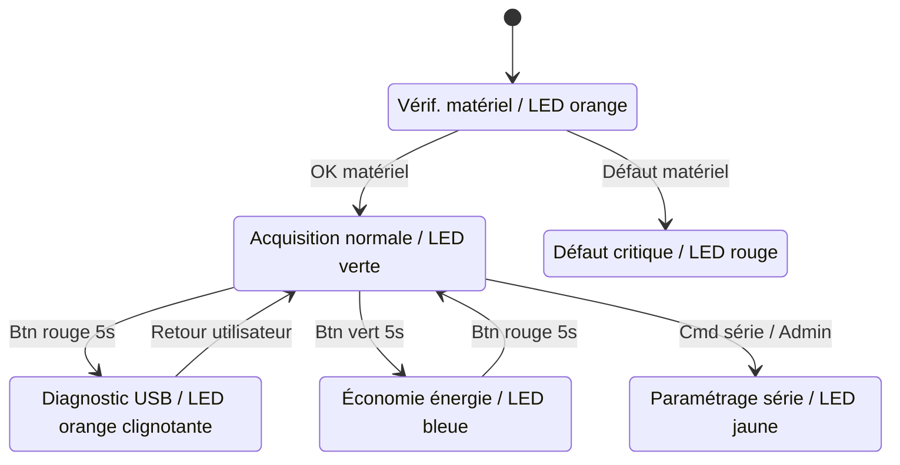
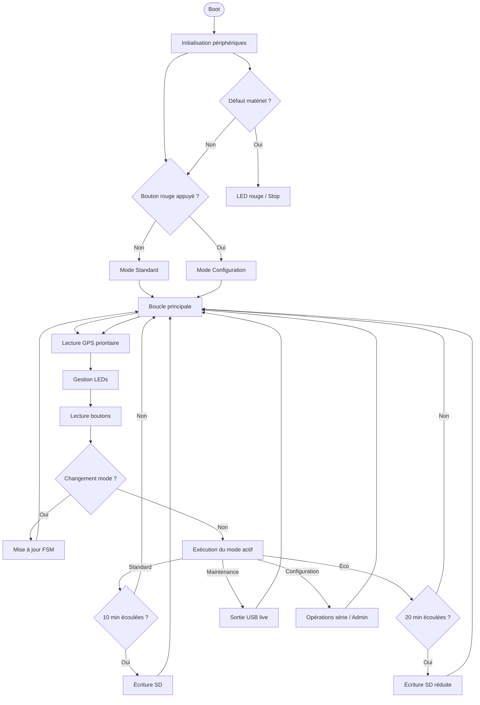
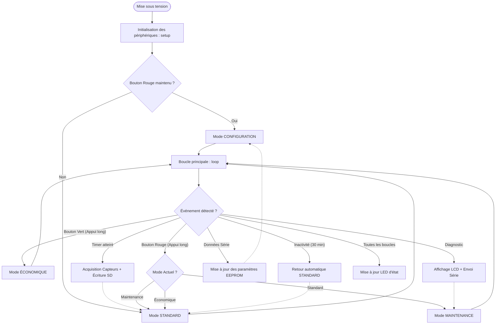

# Worldwide Weather Watcher — Prototype V1

Livrable 2 — Architecture Logicielle et Fonctionnelle


- Microcontrôleur : Seeeduino Lotus (ATmega328P)
- Capteurs : Grove + GPS + Carte SD
- Architecture : Firmware événementiel non bloquant
- Auteurs: ANDRIANARISATA Tsiky; LANDRIER Quentin; LALINNE Robin; BARAKAT Helena


# 1. Philosophie Logicielle

Le firmware repose sur une architecture non bloquante.

Aucune utilisation de `delay()` afin de permettre :

- Lecture GPS continue (NMEA 9600 bauds)
- Détection d'appuis longs (>5s)
- Gestion simultanée des LEDs d’état
- Écriture sécurisée sur carte SD

Le système est piloté par une Machine à États Finis (FSM).


# 2. Machine à États (Modes système)

```mermaid

  stateDiagram-v2
    [*] --> INITIALISATION

    INITIALISATION : Vérif. matériel / LED orange
    STANDARD : Acquisition normale / LED verte
    CONFIGURATION : Paramétrage série / LED jaune
    MAINTENANCE : Diagnostic USB / LED orange clignotante
    ECO : Économie énergie / LED bleue
    ERREUR : Défaut critique / LED rouge

    INITIALISATION --> STANDARD : OK matériel
    INITIALISATION --> ERREUR : Défaut matériel

    STANDARD --> MAINTENANCE : Btn rouge 5s
    STANDARD --> ECO : Btn vert 5s
    STANDARD --> CONFIGURATION : Cmd série / Admin

    ECO --> STANDARD : Btn rouge 5s
    MAINTENANCE --> STANDARD : Retour utilisateur

```


# 3. Algorithme Principal

Architecture coopérative temps réel.


```mermaid
flowchart TD
    START([Boot]) --> INIT[Initialisation périphériques]
    INIT --> CHECK{Bouton rouge appuyé ?}

    CHECK -- Oui --> CONFIG[Mode Configuration]
    CHECK -- Non --> STANDARD[Mode Standard]

    STANDARD --> LOOP[Boucle principale]
    CONFIG --> LOOP

    LOOP --> GPS[Lecture GPS prioritaire]
    GPS --> LED[Gestion LEDs]
    LED --> BTN[Lecture boutons]

    BTN --> MODE{Changement mode ?}
    MODE -- Oui --> SWITCH[Mise à jour FSM]
    MODE -- Non --> EXEC[Exécution du mode actif]

    %% Mode Standard
    EXEC -- Standard --> TIMER1{10 min écoulées ?}
    TIMER1 -- Oui --> SDWRITE[Écriture SD]
    TIMER1 -- Non --> LOOP
    SDWRITE --> LOOP

    %% Mode Eco
    EXEC -- Eco --> TIMER2{20 min écoulées ?}
    TIMER2 -- Oui --> SDWRITE2[Écriture SD réduite]
    TIMER2 -- Non --> LOOP
    SDWRITE2 --> LOOP

    %% Mode Maintenance
    EXEC -- Maintenance --> SERIAL[Sortie USB live]
    SERIAL --> LOOP

    %% Mode Configuration
    EXEC -- Configuration --> CONFIG_OPS[Opérations série / Admin]
    CONFIG_OPS --> LOOP

    %% Changement de mode
    SWITCH --> LOOP

    %% Cas d'erreur
    INIT --> ERREUR{Défaut matériel ?}
    ERREUR -- Oui --> LED_ERR[LED rouge / Stop]
    ERREUR -- Non --> CHECK

    %% Boucle générale
    LOOP --> GPS

```


# 4. Gestion des Fichiers SD

## Format des logs

```
AAMMJJ_R.LOG
```

Exemple :

```
260213_0.LOG
```

### Rotation automatique

- écriture dans `_0.LOG`
- dépassement taille → renommage `_1.LOG`
- nouveau fichier créé


# 5. Diagnostic LED (Codes erreurs)

```mermaid
gantt
    %%{init: { 'theme': 'base', 'themeVariables': {
        'critBkgColor': '#ff0000',
        'doneTaskBkgColor': '#00ff00',
        'activeTaskBkgColor': '#0000ff',
        'taskBkgColor': '#ffffff'
    }}}%%
    title Signaux d'Erreur Lumineux (Cycles de 2 secondes)
    dateFormat  ss
    axisFormat  %S s

    section RTC HS
    Rouge (Erreur)      :crit, 00, 01
    Bleu (Horloge)      :active, 01, 02

    section Capteur HS
    Rouge (Erreur)      :crit, 00, 01
    Vert (Données)      :done, 01, 02

    section SD Pleine / HS
    Rouge (Erreur)      :crit, 00, 01
    Blanc (Stockage)    :01, 02
```


# 6. Paramètres Configurables
| Paramètre      | Domaine       | Défaut  | Description                                                                 |
|----------------|---------------|---------|-----------------------------------------------------------------------------|
| LUMIN          | {0, 1}        | 1       | Activation (1) / Désactivation (0) du capteur de luminosité.               |
| LUMIN_LOW      | 0-1023        | 255     | Seuil en dessous duquel la luminosité est considérée comme "faible".       |
| LUMIN_HIGH     | 0-1023        | 768     | Seuil au-dessus duquel la luminosité est considérée comme "forte".         |
| TEMP_AIR       | {0, 1}        | 1       | Activation (1) / Désactivation (0) du capteur de température.              |
| MIN_TEMP_AIR   | -40-85        | -10     | Seuil T° (°C) en dessous duquel le capteur se met en erreur.               |
| MAX_TEMP_AIR   | -40-85        | 60      | Seuil T° (°C) au-dessus duquel le capteur se met en erreur.                |
| HYGR           | {0, 1}        | 1       | Activation (1) / Désactivation (0) du capteur d'hygrométrie.               |
| HYGR_MINT      | -40-85        | 0       | T° en dessous de laquelle les mesures d'hygrométrie sont ignorées.          |
| HYGR_MAXT      | -40-85        | 50      | T° au-dessus de laquelle les mesures d'hygrométrie sont ignorées.           |
| PRESSURE       | {0, 1}        | 1       | Activation (1) / Désactivation (0) du capteur de pression.                 |
| PRESSURE_MIN   | 300-1100      | 850     | Seuil Pression (hPa) en dessous duquel le capteur se met en erreur.        |
| PRESSURE_MAX   | 300-1100      | 1080    | Seuil Pression (hPa) au-dessus duquel le capteur se met en erreur.         |
| LOG_INTERVAL   | -             | 10 min  | Intervalle entre deux mesures (Paramètre système standard).                 |
| FILE_MAX_SIZE  | -             | 2048    | Taille maximale d'un fichier de log (octets).                               |
| TIMEOUT        | -             | 30 s    | Temps max d'attente réponse capteur.                                        |


Architecture Firmware
flowchart LR


    APP[Application FSM]
    DRIVERS[Drivers Capteurs]
    HAL[HAL Microcontrôleur]
    HW[Hardware ATmega328P]

    APP --> DRIVERS
    DRIVERS --> HAL
    HAL --> HW


Objectifs Techniques
Firmware non bloquant
Acquisition multi-capteurs
Gestion énergétique
Diagnostic terrain
Intégrité des données

# 7. Pseudo-Code
## 1. Déclarations globales (Énumérations et Structures)

```cpp
// --- ÉNUMÉRATIONS (Pour les switch case) ---

[cite_start]// Les 4 modes de la station 
enum ModeStation { STANDARD, CONFIGURATION, MAINTENANCE, ECONOMIQUE };

// Les événements possibles (matériels ou logiciels)
enum Evenement { AUCUN, BOUTON_ROUGE_DEMARRAGE, BOUTON_ROUGE_5S, BOUTON_VERT_5S, TIMER_ACQUISITION, TIMEOUT_CONFIG_30M, RECEPTION_UART };

[cite_start]// Les états de santé du système (incluant les erreurs matérielles) 
enum EtatSysteme { 
    OK, 
    ERREUR_RTC,                 // Rouge/Bleu 
    ERREUR_GPS,                 // Rouge/Jaune 
    ERREUR_CAPTEUR_ACCES,       // Rouge/Vert (durées identiques)
    ERREUR_CAPTEUR_INCOHERENT,  // Rouge/Vert (Vert plus long)
    SD_PLEINE,                  // Rouge/Blanc (durées identiques)
    ERREUR_SD_ACCES             // Rouge/Blanc (Blanc plus long)
};

[cite_start]// Les commandes console (Mode Configuration) 
enum CommandeSerie { 
    INCONNUE, SET_LOG_INTERVAL, SET_FILE_MAX_SIZE, SET_TIMEOUT, 
    SET_LUMIN, SET_TEMP_AIR, SET_HYGR, SET_PRESSURE, 
    SET_CLOCK, SET_DATE, SET_DAY, CMD_RESET, CMD_VERSION 
};

// --- STRUCTURES DE DONNÉES ---

[cite_start]// Paramètres stockés en mémoire EEPROM 
struct ConfigurationSysteme {
    int logInterval;       // Par défaut 10 min
    int fileMaxSize;       // Par défaut 2048 octets
    int timeoutCapteur;    // Par défaut 30 sec
    
    int luminActif;        // 1 (activé) ou 0 (désactivé)
    int luminLow;
    int luminHigh;
    
    int tempAirActif;
    int minTempAir;
    int maxTempAir;
    
    int hygrActif;
    int hygrMinT;
    int hygrMaxT;
    
    int pressureActif;
    int pressureMin;
    int pressureMax;
};

// Données d'un cycle de mesure
struct MesuresMeteo {
    char horodatage[20];
    float temperature;   // Prendra la valeur "NA" en cas de timeout
    float pression;      
    float humidite;      
    int luminosite;      
    float latitude;
    float longitude;
};

// --- VARIABLES GLOBALES ---

ModeStation modeActuel = STANDARD;
ModeStation modePrecedent = STANDARD; [cite_start]// Utile pour le retour de maintenance 
Evenement eventActuel = AUCUN;
EtatSysteme etatGlobal = OK;

ConfigurationSysteme config;
MesuresMeteo dernieresMesures;
int compteurCycleEco = 0; [cite_start]// Pour la parité du GPS en mode éco 
```
## 2. Initialisation et Boucle Principale

```cpp
void setup() {
    initialiserMateriel();
    chargerConfigurationEEPROM(&config);

    [cite_start]// Détection du mode au démarrage 
    Evenement eventDemarrage = lireBoutonRougeDemarrage();
    
    switch (eventDemarrage) {
        case BOUTON_ROUGE_DEMARRAGE:
            modeActuel = CONFIGURATION;
            allumerLED_Jaune(); [cite_start]// 
            demarrerMinuteurInactivite();
            break;
            
        case AUCUN:
        default:
            modeActuel = STANDARD;
            allumerLED_Verte(); [cite_start]// 
            demarrerTimerAcquisition(config.logInterval);
            break;
    }
}

void loop() {
    // 1. Écoute continue des événements matériels
    eventActuel = detecterEvenement(); 

    // 2. Aiguillage selon le mode en cours (Machine à états principale)
    switch (modeActuel) {
        case STANDARD:
            gererModeStandard(eventActuel);
            break;
            
        case ECONOMIQUE:
            gererModeEconomique(eventActuel);
            break;
            
        case MAINTENANCE:
            gererModeMaintenance(eventActuel);
            break;
            
        case CONFIGURATION:
            gererModeConfiguration(eventActuel);
            break;
    }
    
    // 3. Gestion globale des erreurs visuelles (indépendante du mode)
    afficherErreurLED(etatGlobal);
}
```
## 3. Fonctions de gestion des Modes (Les sous-machines à états)
```cpp
void gererModeStandard(Evenement event) {
    switch (event) {
        case TIMER_ACQUISITION:
            etatGlobal = acquerirHorodatage(&dernieresMesures);
            
            switch (etatGlobal) {
                case OK:
                    etatGlobal = acquerirTousCapteursActifs(&dernieresMesures, &config);
                    [cite_start]// Gestion de l'archivage SD (AAMMJJ_0.LOG) 
                    verifierTailleEtArchiverFichierSD(config.fileMaxSize); 
                    etatGlobal = ecrireSurSD(dernieresMesures);
                    break;
            }
            break;

        case BOUTON_VERT_5S:
            [cite_start]// Passage en mode Économique 
            modeActuel = ECONOMIQUE;
            compteurCycleEco = 0;
            allumerLED_Bleue(); [cite_start]//
            demarrerTimerAcquisition(config.logInterval * 2); [cite_start]// 
            break;

        case BOUTON_ROUGE_5S:
            [cite_start]// Passage en mode Maintenance 
            modePrecedent = STANDARD;
            modeActuel = MAINTENANCE;
            allumerLED_Orange(); [cite_start]// 
            arreterBusSPI(); [cite_start]// Sécurisation carte SD 
            break;

        case AUCUN:
        default:
            break;
    }
}

void gererModeEconomique(Evenement event) {
    switch (event) {
        case TIMER_ACQUISITION:
            // L'intervalle est déjà doublé
            acquerirHorodatage(&dernieresMesures);
            acquerirCapteursMeteoActifs(&dernieresMesures, &config);
            
            [cite_start]// Gestion de l'énergie GPS (1 cycle sur 2) 
            switch (compteurCycleEco % 2) {
                case 0: // Cycle Pair
                    acquerirGPS(&dernieresMesures);
                    memoriserDernierePosition(dernieresMesures);
                    break;
                case 1: // Cycle Impair
                    recupererDernierePosition(&dernieresMesures);
                    break;
            }
            compteurCycleEco++;
            
            ecrireSurSD(dernieresMesures);
            break;

        case BOUTON_ROUGE_5S:
            [cite_start]// Retour au Standard 
            modeActuel = STANDARD;
            allumerLED_Verte();
            demarrerTimerAcquisition(config.logInterval);
            break;
            
        case AUCUN:
        default:
            break;
    }
}

void gererModeMaintenance(Evenement event) {
    switch (event) {
        case TIMER_ACQUISITION:
            [cite_start]// Envoi des données en direct via UART (pas d'écriture SD) 
            acquerirTousCapteursActifs(&dernieresMesures, &config);
            envoyerDonneesConsoleSerie(dernieresMesures);
            break;

        case BOUTON_ROUGE_5S:
            [cite_start]// Sortie de maintenance et retour au mode précédent
            reinitialiserCommunicationSD(); [cite_start]// 
            modeActuel = modePrecedent;
            
            switch (modeActuel) {
                case STANDARD:
                    allumerLED_Verte();
                    break;
                case ECONOMIQUE:
                    allumerLED_Bleue();
                    break;
            }
            break;
            
        case AUCUN:
        default:
            break;
    }
}

void gererModeConfiguration(Evenement event) {
    switch (event) {
        case RECEPTION_UART:
            resetMinuteurInactivite(); 
            CommandeSerie cmd = lireCommandeSerie();
            
            switch (cmd) {
                case SET_LOG_INTERVAL:
                case SET_FILE_MAX_SIZE:
                case SET_TIMEOUT:
                case SET_LUMIN:
                case SET_TEMP_AIR:
                    appliquerNouveauParametreEEPROM(&config);
                    envoyerMessageConsole("OK: Parametre mis a jour");
                    break;
                case SET_CLOCK:
                case SET_DATE:
                    mettreAJourRTC();
                    envoyerMessageConsole("OK: Horloge mise a jour");
                    break;
                case CMD_VERSION:
                    envoyerMessageConsole("V1.0 LOT ABC"); [cite_start]// 
                    break;
                case CMD_RESET:
                    reinitialiserParametresUsine(&config); [cite_start]//
                    break;
                case INCONNUE:
                    envoyerMessageConsole("Syntax Error");
                    break;
            }
            break;

        case TIMEOUT_CONFIG_30M:
            [cite_start]// 30 min sans activité 
            modeActuel = STANDARD;
            allumerLED_Verte();
            demarrerTimerAcquisition(config.logInterval);
            break;
            
        case AUCUN:
        default:
            break;
    }
}
```
## 4. Fonction d'affichage des erreurs (Détachée pour la clarté)
```cpp
// Affiche les codes couleur sur la LED RGB en fonction du mode ou de l'erreur
void mettreAJourLED() {
  static unsigned long dernierUpdateLED = 0;
  if (millis() - dernierUpdateLED < 50) return; // Limite la fréquence de mise à jour à 50ms max
  dernierUpdateLED = millis();

  unsigned long t = millis() % 1000; // Sert à créer des clignotements
  if (erreurGlobale == ERREUR_RTC_ACCES) { if (t < 500) ledRGB.setColorRGB(0, 255, 0, 0); else ledRGB.setColorRGB(0, 0, 0, 255); }
  else if (erreurGlobale == ERREUR_GPS_ACCES) { if (t < 500) ledRGB.setColorRGB(0, 255, 0, 0); else ledRGB.setColorRGB(0, 255, 255, 0); }
  else if (erreurGlobale == ERREUR_CAPTEUR_ACCES) { if (t < 500) ledRGB.setColorRGB(0, 255, 0, 0); else ledRGB.setColorRGB(0, 0, 255, 0); }
  else if (erreurGlobale == ERREUR_CAPTEUR_INCOHERENT) { if (t < 333) ledRGB.setColorRGB(0, 255, 0, 0); else ledRGB.setColorRGB(0, 0, 255, 0); }
  else if (erreurGlobale == ERREUR_SD_PLEINE) { if (t < 500) ledRGB.setColorRGB(0, 255, 0, 0); else ledRGB.setColorRGB(0, 255, 255, 255); }
  else if (erreurGlobale == ERREUR_SD_ACCES) { if (t < 333) ledRGB.setColorRGB(0, 255, 0, 0); else ledRGB.setColorRGB(0, 255, 255, 255); }
}
```

## 5.Code complet 
```cpp
/*
* PROJET: World Wide Weather Watcher
*/

#include <Arduino.h>
#include <Wire.h>
#include <SPI.h>
#include <SD.h>
#include <EEPROM.h>
#include <util/atomic.h>
#include <ChainableLED.h>
#include <DHT.h>
#include <RTClib.h>
#include <SoftwareSerial.h>
#include <MicroNMEA.h> 
#include <rgb_lcd.h> 

#define PIN_BTN_ROUGE 2
#define PIN_BTN_VERT 3
#define PIN_LED_CLK 4
#define PIN_LED_DATA 5
#define PIN_SD_CS 10
#define PIN_CAPTEUR_LUMIN A2
#define DHTPIN 6
#define DHTTYPE DHT11

DHT dht(DHTPIN, DHTTYPE);
SoftwareSerial gpsSerial(7, 8);
char nmeaBuffer[85];
MicroNMEA nmea(nmeaBuffer, sizeof(nmeaBuffer));

ChainableLED ledRGB(PIN_LED_CLK, PIN_LED_DATA, 1);
RTC_DS1307 rtc;
rgb_lcd lcd; 

volatile unsigned long isrTempsAppuiRouge = 0;
volatile unsigned long isrTempsAppuiVert = 0;
volatile bool isrRougeActif = false;
volatile bool isrVertActif = false;

ISR(INT0_vect) {
  if (digitalRead(PIN_BTN_ROUGE) == LOW) {
    if (!isrRougeActif) { isrTempsAppuiRouge = millis(); isrRougeActif = true; }
  } else { isrRougeActif = false; }
}

ISR(INT1_vect) {
  if (digitalRead(PIN_BTN_VERT) == LOW) {
    if (!isrVertActif) { isrTempsAppuiVert = millis(); isrVertActif = true; }
  } else { isrVertActif = false; }
}

enum ModeStation { STANDARD, CONFIGURATION, MAINTENANCE, ECONOMIQUE };
enum Evenement { AUCUN, BOUTON_ROUGE_5S, BOUTON_VERT_5S, TIMER_ACQUISITION, TIMEOUT_CONFIG_30M, RECEPTION_UART };
enum TypeErreur { SANS_ERREUR, ERREUR_CAPTEUR_ACCES, ERREUR_CAPTEUR_INCOHERENT, ERREUR_SD_PLEINE, ERREUR_SD_ACCES, ERREUR_GPS_ACCES, ERREUR_RTC_ACCES };

typedef struct {
  int logInterval; unsigned long fileMaxSize; int timeoutCapteur;
  byte luminActif; int luminLow; int luminHigh;
  byte tempAirActif; int minTempAir; int maxTempAir;
  byte hygrActif; int hygrMinT; int hygrMaxT;
  byte pressureActif; int pressureMin; int pressureMax;
  byte _initialised;
} ConfigurationSysteme;

typedef struct {
  uint16_t annee; uint8_t mois; uint8_t jour;
  uint8_t heure; uint8_t minute; uint8_t seconde;
  float temperature; float humidite; int luminosite;
  float latitude; float longitude;
} MesuresMeteo;

ModeStation modeActuel = STANDARD;
ModeStation modePrecedent = STANDARD;
volatile TypeErreur erreurGlobale = SANS_ERREUR;
Evenement eventActuel = AUCUN;
ConfigurationSysteme config;
MesuresMeteo dernieresMesures;

unsigned long dernierTempsAcquisition = 0;
unsigned long debutInactiviteConfig = 0;

byte nbErrTemp = 0;
byte nbErrHygr = 0;

void print02d(Print& p, int val);
void mettreAJourLED();
void acquerirDonneesMeteo(MesuresMeteo* m);
void ecrireSurSD(const MesuresMeteo& m);
void envoyerDonneesSerie(const MesuresMeteo& m);
void afficherMeteoLCD(const MesuresMeteo& m); 
void afficherLegende();
Evenement detecterEvenement();
void traiterCommandeSerie();
void appliquerParametresParDefaut();

const char cmd_01[] PROGMEM = "LOG_INTERVAL=";
const char cmd_02[] PROGMEM = "FILE_MAX_SIZE=";
const char cmd_03[] PROGMEM = "TIMEOUT=";
const char cmd_04[] PROGMEM = "LUMIN=";
const char cmd_05[] PROGMEM = "LUMIN_LOW=";
const char cmd_06[] PROGMEM = "LUMIN_HIGH=";
const char cmd_07[] PROGMEM = "TEMP_AIR=";
const char cmd_08[] PROGMEM = "MIN_TEMP_AIR=";
const char cmd_09[] PROGMEM = "MAX_TEMP_AIR=";
const char cmd_10[] PROGMEM = "HYGR=";
const char cmd_11[] PROGMEM = "HYGR_MINT=";
const char cmd_12[] PROGMEM = "HYGR_MAXT=";
const char cmd_13[] PROGMEM = "PRESSURE=";
const char cmd_14[] PROGMEM = "PRESSURE_MIN=";
const char cmd_15[] PROGMEM = "PRESSURE_MAX=";

enum VarType { T_INT, T_BYTE, T_ULONG };
typedef struct { const char* texte; uint8_t len; void* ptrVar; VarType type; } DicoCmd;

const DicoCmd tableCommandes[] PROGMEM = {
  { cmd_01, 13, &config.logInterval, T_INT }, { cmd_02, 14, &config.fileMaxSize, T_ULONG },
  { cmd_03, 8, &config.timeoutCapteur, T_INT }, { cmd_04, 6, &config.luminActif, T_BYTE },
  { cmd_05, 10, &config.luminLow, T_INT }, { cmd_06, 11, &config.luminHigh, T_INT },
  { cmd_07, 9, &config.tempAirActif, T_BYTE }, { cmd_08, 13, &config.minTempAir, T_INT },
  { cmd_09, 13, &config.maxTempAir, T_INT }, { cmd_10, 5, &config.hygrActif, T_BYTE },
  { cmd_11, 10, &config.hygrMinT, T_INT }, { cmd_12, 10, &config.hygrMaxT, T_INT },
  { cmd_13, 9, &config.pressureActif, T_BYTE }, { cmd_14, 13, &config.pressureMin, T_INT },
  { cmd_15, 13, &config.pressureMax, T_INT }
};
const uint8_t NB_COMMANDES = sizeof(tableCommandes) / sizeof(tableCommandes[0]);

void appliquerParametresParDefaut() {
  config.logInterval = 10; config.fileMaxSize = 2048; config.timeoutCapteur = 30;
  config.luminActif = 1; config.luminLow = 255; config.luminHigh = 768;
  config.tempAirActif = 1; config.minTempAir = -10; config.maxTempAir = 60;
  config.hygrActif = 1; config.hygrMinT = 0; config.hygrMaxT = 50;
  config.pressureActif = 1; config.pressureMin = 850; config.pressureMax = 1080;
  config._initialised = 42;
  EEPROM.put(0, config);
  Serial.println(F("Param. defaut OK"));
}

void configurerInterruptions() {
  EICRA |= (1 << ISC00); EICRA &= ~(1 << ISC01); EICRA |= (1 << ISC10); EICRA &= ~(1 << ISC11); EIMSK |= (1 << INT0) | (1 << INT1);
}

void setup() {
  Serial.begin(9600);
  while (!Serial);
  Serial.println(F("\nSTATION METEO"));

  Wire.begin();
  pinMode(PIN_BTN_ROUGE, INPUT_PULLUP); pinMode(PIN_BTN_VERT, INPUT_PULLUP);
  pinMode(PIN_CAPTEUR_LUMIN, INPUT); pinMode(PIN_SD_CS, OUTPUT); digitalWrite(PIN_SD_CS, HIGH);

  configurerInterruptions();
  sei();

  lcd.begin(16, 2); lcd.clear(); lcd.print(F("Station Meteo")); lcd.setCursor(0, 1); lcd.print(F("Demarrage..."));
  delay(1500); lcd.noDisplay(); 

  if (!rtc.begin() || !rtc.isrunning()) rtc.adjust(DateTime(F(__DATE__), F(__TIME__)));
  dht.begin();

  if (!SD.begin(PIN_SD_CS)) { Serial.println(F("SD: Erreur")); erreurGlobale = ERREUR_SD_ACCES; } 
  else { Serial.println(F("SD: OK")); erreurGlobale = SANS_ERREUR; }

  gpsSerial.begin(9600);
  
  EEPROM.get(0, config);
  if (config._initialised != 42 || config.logInterval <= 0) appliquerParametresParDefaut();

  if (digitalRead(PIN_BTN_ROUGE) == LOW) {
    modeActuel = CONFIGURATION; debutInactiviteConfig = millis(); Serial.println(F("MODE: CONFIG"));
  } else {
    modeActuel = STANDARD; dernierTempsAcquisition = millis() - (config.logInterval * 60000UL);
    Serial.println(F("MODE: STANDARD")); afficherLegende();
  }
}

void loop() {
  eventActuel = detecterEvenement();
  switch (modeActuel) {
    case STANDARD:
      if (eventActuel == TIMER_ACQUISITION) { acquerirDonneesMeteo(&dernieresMesures); ecrireSurSD(dernieresMesures); }
      else if (eventActuel == BOUTON_VERT_5S) { Serial.println(F("\n> ECO")); modeActuel = ECONOMIQUE; }
      else if (eventActuel == BOUTON_ROUGE_5S) {
        Serial.println(F("\n> MAINT")); modePrecedent = STANDARD; modeActuel = MAINTENANCE;
        lcd.display(); lcd.clear(); lcd.print(F("MAINTENANCE")); afficherLegende();
      }
      break;
    case ECONOMIQUE:
      if (eventActuel == TIMER_ACQUISITION) { acquerirDonneesMeteo(&dernieresMesures); ecrireSurSD(dernieresMesures); envoyerDonneesSerie(dernieresMesures); }
      else if (eventActuel == BOUTON_ROUGE_5S) { Serial.println(F("\n> STD")); modeActuel = STANDARD; afficherLegende(); }
      break;
    case MAINTENANCE:
      {
        // Ce "timer" est indépendant de la carte SD, il sert juste pour l'écran
        static unsigned long dernierTempsReel = 0;
        
        // On rafraîchit les mesures et l'écran toutes les 4 secondes (Temps Réel)
        if (millis() - dernierTempsReel >= 1000) {
          dernierTempsReel = millis();
          
          acquerirDonneesMeteo(&dernieresMesures); // 1. On prend des mesures fraîches
          afficherMeteoLCD(dernieresMesures);      // 2. On met à jour l'écran LCD
          envoyerDonneesSerie(dernieresMesures);   // 3. On envoie aussi sur le PC en direct
        }
        
        // Si on appuie 5s sur le bouton rouge pour quitter
        if (eventActuel == BOUTON_ROUGE_5S) {
          Serial.println(F("\n> Sortie MAINT")); 
          modeActuel = modePrecedent; 
          
          // On nettoie et on éteint l'écran pour économiser l'énergie
          lcd.clear(); 
          lcd.noDisplay(); 
          afficherLegende();
        }
      }
      break;
    case CONFIGURATION:
      if (eventActuel == RECEPTION_UART) { debutInactiviteConfig = millis(); traiterCommandeSerie(); }
      else if (eventActuel == TIMEOUT_CONFIG_30M) {
        Serial.println(F("\n> Timeout CONFIG")); modeActuel = STANDARD; dernierTempsAcquisition = millis() - (config.logInterval * 60000UL); afficherLegende();
      }
      break;
  }
  mettreAJourLED();
}

Evenement detecterEvenement() {
  unsigned long tRouge = 0; bool rActif = false;
  ATOMIC_BLOCK(ATOMIC_RESTORESTATE) { tRouge = isrTempsAppuiRouge; rActif = isrRougeActif; }
  if (rActif && tRouge != 0 && (millis() - tRouge >= 5000)) { ATOMIC_BLOCK(ATOMIC_RESTORESTATE) { isrTempsAppuiRouge = 0; isrRougeActif = false; } return BOUTON_ROUGE_5S; }

  unsigned long tVert = 0; bool vActif = false;
  ATOMIC_BLOCK(ATOMIC_RESTORESTATE) { tVert = isrTempsAppuiVert; vActif = isrVertActif; }
  if (vActif && tVert != 0 && (millis() - tVert >= 5000)) { ATOMIC_BLOCK(ATOMIC_RESTORESTATE) { isrTempsAppuiVert = 0; isrVertActif = false; } return BOUTON_VERT_5S; }

  if (Serial.available() > 0) return RECEPTION_UART;

  unsigned long intervalle = config.logInterval * 60000UL;
  if (modeActuel == ECONOMIQUE) intervalle *= 2; 

  if (modeActuel != CONFIGURATION && (millis() - dernierTempsAcquisition >= intervalle)) { dernierTempsAcquisition = millis(); return TIMER_ACQUISITION; }
  if (modeActuel == CONFIGURATION && (millis() - debutInactiviteConfig >= 1800000UL)) { return TIMEOUT_CONFIG_30M; }
  return AUCUN;
}

void acquerirDonneesMeteo(MesuresMeteo* m) {
  erreurGlobale = SANS_ERREUR; 

  if (!rtc.isrunning()) { erreurGlobale = ERREUR_RTC_ACCES; } 
  else {
    DateTime maintenant = rtc.now();
    m->annee = maintenant.year(); m->mois = maintenant.month(); m->jour = maintenant.day();
    m->heure = maintenant.hour(); m->minute = maintenant.minute(); m->seconde = maintenant.second();
  }

  if (config.luminActif) {
    m->luminosite = analogRead(PIN_CAPTEUR_LUMIN);
    if (m->luminosite < config.luminLow || m->luminosite > config.luminHigh) erreurGlobale = ERREUR_CAPTEUR_INCOHERENT;
  } else m->luminosite = -1; 

  if (config.tempAirActif) {
    float t = dht.readTemperature();
    if (isnan(t)) {
      m->temperature = NAN; nbErrTemp++;
      if (nbErrTemp >= 2) erreurGlobale = ERREUR_CAPTEUR_ACCES; 
    } else {
      nbErrTemp = 0; m->temperature = t;
      if (t < config.minTempAir || t > config.maxTempAir) erreurGlobale = ERREUR_CAPTEUR_INCOHERENT;
    }
  } else m->temperature = NAN;

  if (config.hygrActif) {
    if (!isnan(m->temperature) && m->temperature >= config.hygrMinT && m->temperature <= config.hygrMaxT) {
       float h = dht.readHumidity();
       if (isnan(h)) { m->humidite = NAN; nbErrHygr++; if (nbErrHygr >= 2) erreurGlobale = ERREUR_CAPTEUR_ACCES; } 
       else { nbErrHygr = 0; m->humidite = h; }
    } else m->humidite = NAN; 
  } else m->humidite = NAN; 

  static bool sauterGPS = false;
  if (modeActuel == ECONOMIQUE) sauterGPS = !sauterGPS; else sauterGPS = false;
  m->latitude = 0.0; m->longitude = 0.0;
  
  if (!sauterGPS) {
    gpsSerial.begin(9600);
    unsigned long startGPS = millis(); 
    uint16_t caracteresRecus = 0;
    
    // On convertit le paramètre TIMEOUT (en secondes) en millisecondes
    unsigned long timeoutMax = config.timeoutCapteur * 1000UL; 

    // On écoute le GPS jusqu'à atteindre la limite du TIMEOUT
    while (millis() - startGPS < timeoutMax) {
      while (gpsSerial.available() > 0) {
        caracteresRecus++;
        if (nmea.process(gpsSerial.read()) && nmea.isValid()) {
            m->latitude = nmea.getLatitude() / 1000000.0; 
            m->longitude = nmea.getLongitude() / 1000000.0;
        }
      }
      // OPTIMISATION : Si on a trouvé des coordonnées valides, on n'attend pas la fin du TIMEOUT !
      if (m->latitude != 0.0 && m->longitude != 0.0) {
        break; 
      }
    }
    gpsSerial.end(); delay(50);
    
    // Si la puce ne répond pas ou ne trouve pas de satellite après le temps imparti (Timeout)
    if (caracteresRecus == 0 || (m->latitude == 0.0 && m->longitude == 0.0)) {
      //erreurGlobale = ERREUR_GPS_ACCES;
    }
  }
}

// ===============================================================
// Archivage SD strict et Optimisé (Sans snprintf)
// ===============================================================
void ecrireSurSD(const MesuresMeteo& m) {
    char nomF0[13] = "000000_0.LOG";
    uint8_t y = m.annee % 100;
    nomF0[0] = '0' + (y / 10); nomF0[1] = '0' + (y % 10);
    nomF0[2] = '0' + (m.mois / 10); nomF0[3] = '0' + (m.mois % 10);
    nomF0[4] = '0' + (m.jour / 10); nomF0[5] = '0' + (m.jour % 10);
    
    File f = SD.open(nomF0, FILE_WRITE);
    if (!f) { SD.end(); if (SD.begin(PIN_SD_CS)) f = SD.open(nomF0, FILE_WRITE); }
    if (!f) { Serial.println(F("SD: ERR")); erreurGlobale = ERREUR_SD_ACCES; return; }

    print02d(f, m.jour); f.print('/'); print02d(f, m.mois); f.print('/'); f.print(m.annee); f.print(',');
    print02d(f, m.heure); f.print(':'); print02d(f, m.minute); f.print(':'); print02d(f, m.seconde); f.print(',');
    if (isnan(m.temperature)) f.print(F("NA,")); else { f.print(m.temperature, 1); f.print(','); }
    if (isnan(m.humidite)) f.print(F("NA,")); else { f.print(m.humidite, 1); f.print(','); }
    if (m.luminosite == -1) f.print(F("NA,")); else { f.print(m.luminosite); f.print(','); }
    if (m.latitude == 0.0) f.println(F("NA,NA")); else { f.print(m.latitude, 6); f.print(','); f.println(m.longitude, 6); }

    uint32_t taille = f.size(); f.close();

    if (taille >= config.fileMaxSize) {
        char nomArch[13];
        strcpy(nomArch, nomF0);
        for (int i = 1; i <= 9; i++) { 
            nomArch[7] = '0' + i;
            if (!SD.exists(nomArch)) {
                File src = SD.open(nomF0, FILE_READ); File dst = SD.open(nomArch, FILE_WRITE);
                if (src && dst) { uint8_t buf[64]; while(src.available()) { dst.write(buf, src.read(buf, sizeof(buf))); } }
                if (src) src.close(); if (dst) dst.close();
                SD.remove(nomF0); Serial.print(F("Arch. cree: ")); Serial.println(nomArch); break;
            }
        }
    }
}

void mettreAJourLED() {
  // --- NOUVEAU : On limite l'envoi de données à la LED ---
  static unsigned long dernierUpdateLED = 0;
  if (millis() - dernierUpdateLED < 50) return; // Sort de la fonction si 50ms ne sont pas écoulées
  dernierUpdateLED = millis();
  // --------------------------------------------------------

  unsigned long t = millis() % 1000;
  if (erreurGlobale == ERREUR_RTC_ACCES) { if (t < 500) ledRGB.setColorRGB(0, 255, 0, 0); else ledRGB.setColorRGB(0, 0, 0, 255); }
  else if (erreurGlobale == ERREUR_GPS_ACCES) { if (t < 500) ledRGB.setColorRGB(0, 255, 0, 0); else ledRGB.setColorRGB(0, 255, 255, 0); }
  else if (erreurGlobale == ERREUR_CAPTEUR_ACCES) { if (t < 500) ledRGB.setColorRGB(0, 255, 0, 0); else ledRGB.setColorRGB(0, 0, 255, 0); }
  else if (erreurGlobale == ERREUR_CAPTEUR_INCOHERENT) { if (t < 333) ledRGB.setColorRGB(0, 255, 0, 0); else ledRGB.setColorRGB(0, 0, 255, 0); }
  else if (erreurGlobale == ERREUR_SD_PLEINE) { if (t < 500) ledRGB.setColorRGB(0, 255, 0, 0); else ledRGB.setColorRGB(0, 255, 255, 255); }
  else if (erreurGlobale == ERREUR_SD_ACCES) { if (t < 333) ledRGB.setColorRGB(0, 255, 0, 0); else ledRGB.setColorRGB(0, 255, 255, 255); }
  else {
    if (modeActuel == CONFIGURATION) ledRGB.setColorRGB(0, 255, 255, 0);
    else if (modeActuel == STANDARD) ledRGB.setColorRGB(0, 0, 255, 0);
    else if (modeActuel == ECONOMIQUE) ledRGB.setColorRGB(0, 0, 0, 255);
    else if (modeActuel == MAINTENANCE) ledRGB.setColorRGB(0, 255, 25, 0);
  }
}

void traiterCommandeSerie() {
  char cmdBuffer[40]; size_t len = Serial.readBytesUntil('\n', cmdBuffer, sizeof(cmdBuffer) - 1); cmdBuffer[len] = '\0';
  for (uint8_t i = 0; i < len; i++) { if (cmdBuffer[i] == '\r') cmdBuffer[i] = '\0'; else cmdBuffer[i] = toupper(cmdBuffer[i]); }
  
  if (strcmp_P(cmdBuffer, PSTR("QUITTER")) == 0) { modeActuel = STANDARD; dernierTempsAcquisition = millis() - (config.logInterval * 60000UL); afficherLegende(); return; }
  if (strcmp_P(cmdBuffer, PSTR("RESET")) == 0) { appliquerParametresParDefaut(); return; }
  if (strcmp_P(cmdBuffer, PSTR("VERSION")) == 0) { Serial.println(F("WWWW v1.0 Lot:2026-A")); return; }
  
  // Analyse de texte manuelle ultra-légère (au lieu de sscanf)
  if (strncmp_P(cmdBuffer, PSTR("CLOCK="), 6) == 0) {
    char *p = cmdBuffer + 6;
    uint8_t hh = atoi(p); while(*p && *p != ':') p++; if(*p == ':') p++;
    uint8_t mm = atoi(p); while(*p && *p != ':') p++; if(*p == ':') p++;
    uint8_t ss = atoi(p);
    DateTime now = rtc.now(); rtc.adjust(DateTime(now.year(), now.month(), now.day(), hh, mm, ss)); Serial.println(F("OK")); return;
  }
  if (strncmp_P(cmdBuffer, PSTR("DATE="), 5) == 0) {
    char *p = cmdBuffer + 5;
    uint8_t mois = atoi(p); while(*p && *p != ',') p++; if(*p == ',') p++;
    uint8_t jour = atoi(p); while(*p && *p != ',') p++; if(*p == ',') p++;
    uint16_t annee = atoi(p);
    DateTime now = rtc.now(); rtc.adjust(DateTime(annee, mois, jour, now.hour(), now.minute(), now.second())); Serial.println(F("OK")); return;
  }
  if (strncmp_P(cmdBuffer, PSTR("DAY="), 4) == 0) { Serial.println(F("Auto RTC")); return; }

  for (uint8_t i = 0; i < NB_COMMANDES; i++) {
    const char* strProgmem = (const char*)pgm_read_word(&(tableCommandes[i].texte));
    uint8_t cmdLen = pgm_read_byte(&(tableCommandes[i].len));
    if (strncmp_P(cmdBuffer, strProgmem, cmdLen) == 0) {
      void* cible = (void*)pgm_read_word(&(tableCommandes[i].ptrVar)); VarType type = (VarType)pgm_read_byte(&(tableCommandes[i].type));
      long valeur = atol(cmdBuffer + cmdLen);
      if (type == T_INT) *((int*)cible) = (int)valeur; else if (type == T_BYTE) *((byte*)cible) = (byte)valeur; else if (type == T_ULONG) *((unsigned long*)cible) = (unsigned long)valeur;
      EEPROM.put(0, config); Serial.println(F("MAJ OK")); return;
    }
  }
  Serial.println(F("Cmd inconnue"));
}

void afficherMeteoLCD(const MesuresMeteo& m) {
  lcd.clear(); lcd.setCursor(0, 0); lcd.print(F("T:"));
  if (isnan(m.temperature)) lcd.print(F("--.-")); else lcd.print(m.temperature, 1);
  lcd.print(F("C H:"));
  if (isnan(m.humidite)) lcd.print(F("--.-")); else lcd.print(m.humidite, 1);
  lcd.print(F("%")); lcd.setCursor(0, 1); lcd.print(F("LUM:")); if(m.luminosite == -1) lcd.print("NA"); else lcd.print(m.luminosite);
}

void print02d(Print& p, int val) { if (val < 10) p.print('0'); p.print(val); }

void envoyerDonneesSerie(const MesuresMeteo& m) {
  print02d(Serial, m.jour); Serial.print('/'); print02d(Serial, m.mois); Serial.print('/'); Serial.print(m.annee); Serial.print(F(" "));
  print02d(Serial, m.heure); Serial.print(':'); print02d(Serial, m.minute); Serial.print(':'); print02d(Serial, m.seconde); Serial.print(F(" "));

  if (isnan(m.temperature)) Serial.print(F("NA\t")); else { Serial.print(m.temperature, 1); Serial.print(F("C\t")); }
  if (isnan(m.humidite)) Serial.print(F("NA\t")); else { Serial.print(m.humidite, 1); Serial.print(F("%\t")); }
  if (m.luminosite == -1) Serial.print(F("NA\t")); else { Serial.print(m.luminosite); Serial.print(F("\t")); }

  if (m.latitude == 0.0) Serial.println(F("GPS NA")); else { Serial.print(m.latitude, 6); Serial.print(F(", ")); Serial.println(m.longitude, 6); }
}

void afficherLegende() { Serial.println(F("DATE|HEURE|TEMP|HYGR|LUM|GPS")); }

```

# 8. Documentation
# Worldwide Weather Watcher

## INTRODUCTION
Le projet Worldwide Weather Watcher consiste à développer un prototype de station météo embarquée à destination des navires de surveillance. Le système doit pouvoir mesurer plusieurs paramètres environnementaux, les stocker et permettre à l’utilisateur d’interagir simplement avec lui.

L’objectif est de concevoir un système robuste et fiable, autonome mais modulaire afin de pouvoir intégrer et modifier les composants. La simplicité d’exploitation de ce système doit permettre une utilisation intuitive et efficace par l’utilisateur final.

---

## 1. DOCUMENTATION TECHNIQUE
Cette partie présente l’architecture matérielle et logicielle du système ainsi que les choix techniques ayant guidé la conception.

### 1.1 Architecture matérielle
#### 1.1.1 Microcontrôleur
La centrale météorologique est fondée sur un microcontrôleur ATmega328P, qui constitue la pièce maîtresse de la station. Il gère les capteurs, le traitement des données captées, leur stockage sur la carte SD, la communication entre les divers modules et la prise en charge des interruptions pour garantir un fonctionnement réactif et fiable.

### 1.2 Matériel utilisé
#### 1.2.1 Capteurs
* **DHT11** : Mesure de la température et de l’humidité ambiante.
* **Capteur analogique** : Mesure de la luminosité via l’entrée analogique du microcontrôleur.
* **Module GPS** : Fournit la latitude et la longitude pour la localisation géographique.
* **Module RTC DS1307** : Fournit la date et l’heure précises afin d’horodater chaque mesure enregistrée.

#### 1.2.2 Interfaces
* **Carte SD** : Interface SPI haut débit pour le stockage des données collectées sous un format exploitable (CSV).
* **Écran LCD Grove 16x2** : Communique via le bus I2C pour l’affichage des mesures en mode maintenance.
* **LED RGB** : Indicateur visuel de l’état et des erreurs du système.
* **Boutons poussoirs (Rouge et Vert)** : Permettent à l’utilisateur de changer de mode de fonctionnement et d’interagir avec la station.

### 1.3 Rôle de la carte rouge (Seeeduino Lotus)
La carte rouge Seeeduino Lotus permet un câblage simplifié grâce aux connecteurs Grove intégrés, facilitant l’assemblage du système. Elle améliore l’organisation générale du montage, réduit les risques d’erreurs de connexion et offre une architecture propre et modulaire. Cette conception permet également d’ajouter facilement de nouveaux capteurs ou modules lors d’évolutions futures.

---

## 2. CHOIX TECHNIQUES ET JUSTIFICATION

### 2.1 Architecture événementielle
Le système repose sur une architecture événementielle basée sur :
* Une machine à états (FSM)
* Une détection d’événements
* Des interruptions matérielles

Cette approche assure une séparation claire des comportements selon les modes de fonctionnement, facilite la maintenance du programme et simplifie son évolution future (ajout de nouvelles fonctionnalités/capteurs).

### 2.2 Utilisation des interruptions
Les boutons sont connectés aux interruptions matérielles `INT0` et `INT1` du microcontrôleur, permettant au système de réagir immédiatement à une action de l’utilisateur. Cela garantit une détection précise des appuis longs tout en réduisant la charge du processeur, sans nécessiter de vérification continue dans la boucle principale.

### 2.3 Gestion du temps avec `millis()`
La fonction `millis()` permet :
* Un déclenchement périodique des mesures
* Un fonctionnement non bloquant
* Une meilleure stabilité du système

### 2.4 Choix des protocoles

| Module | Protocole | Justification |
| :--- | :--- | :--- |
| **RTC** | I2C | Bus simple à 2 fils |
| **LCD** | I2C | Partage du bus |
| **SD** | SPI | Rapidité et fiabilité |
| **GPS** | UART | Standard GPS |
| **Luminosité** | Analogique | Lecture directe ADC |

---

## 3. FONCTIONNEMENT GLOBAL DU SYSTÈME

### 3.1 Flux d'information
L’ensemble du traitement s’oriente vers l’acquisition de données fournies par les capteurs. Elles sont transférées au microcontrôleur pour traitement puis, selon l'analyse : stockées sur la carte SD, affichées sur l’écran LCD, utilisées pour piloter la LED d’état, ou envoyées via le port série USB.

**Description :**
1. Les capteurs envoient leurs données au microcontrôleur.
2. Les données sont traitées.
3. Elles sont enregistrées (SD), affichées (LCD) ou envoyées (Serial).
4. La LED indique l’état ou une erreur.

### 3.2 Séquence de fonctionnement
1. Initialisation matérielle (`setup`)
2. Détermination du mode initial
3. Boucle principale (`loop`)
4. Détection d’événement
5. Action selon le mode
6. Mise à jour LED

---

## 4. ARCHITECTURE GÉNÉRALE DU PROGRAMME

### 4.1 Organisation structurelle
* **`setup()`** : Exécutée une seule fois au démarrage. Initialise les périphériques (Serial, I2C, SPI, GPS, DHT, RTC, LCD, SD), configure les interruptions et détermine le mode initial.
* **`loop()`** : Boucle principale. S’exécute en continu, détecte les événements et oriente le comportement en fonction du mode actif.
* **`detecterEvenement()`** : Analyse les sources d’événements (appui long, temporisation d’acquisition, réception commande série, dépassement de temps).
* **`acquerirDonneesMeteo()`** : Réalise l’acquisition des mesures (RTC, DHT, luminosité, GPS).
* **`ecrireSurSD()`** : Enregistre les données au format CSV sur la carte SD et gère les erreurs d’accès.
* **`mettreAJourLED()`** : Adapte la couleur ou le clignotement de la LED RGB selon le mode ou les erreurs.
* **`traiterCommandeSerie()`** : Analyse les commandes via le port série et met à jour les paramètres EEPROM.
* **`afficherMeteoLCD()`** : Affiche les mesures (température, humidité, luminosité) sur l’écran LCD.

### 4.2 Machine à états
**Les 4 modes possibles :**
* **STANDARD** : Acquisition et enregistrement périodique des données.
* **ÉCONOMIQUE** : Réduit la fréquence d’acquisition pour optimiser la consommation.
* **MAINTENANCE** : Diagnostic avec affichage direct des mesures.
* **CONFIGURATION** : Modification des paramètres via le port série.

Un seul mode est actif à la fois. Transitions déclenchées par : Appui long (Rouge/Vert), Timeout configuration, ou Timer interne.

---

## 5. DESCRIPTION DÉTAILLÉE DU CODE

### 5.1 Fonction `setup()`
Exécutée une seule fois. Rôles :
* Initialisation série (9600 bauds), I2C, SPI, GPS, DHT11, RTC, LCD, SD et LED RGB.
* Configuration des broches des boutons en `INPUT_PULLUP` et activation des interruptions `INT0`/`INT1`.
* Détermination du mode initial (Démarrage classique = STANDARD. Si bouton rouge maintenu = CONFIGURATION).

### 5.2 Fonction `loop()`
S’exécute en continu (logique événementielle) :
* **Mode STANDARD** : Mesure et enregistrement périodique.
* **Mode ÉCONOMIQUE** : Similaire au STANDARD, mais intervalle d’acquisition doublé.
* **Mode MAINTENANCE** : Affichage LCD et Envoi Série uniquement (pas d'enregistrement SD).
* **Mode CONFIGURATION** : Attente de commandes série. Retourne en STANDARD après 30 minutes d'inactivité.

### 5.3 Fonction `acquerirDonneesMeteo()`
Regroupe toutes les lectures capteurs (RTC, Luminosité, DHT11, GPS). Les valeurs sont stockées dans une structure `MesuresMeteo`.

### 5.4 Fonction `ecrireSurSD()`
Ouvre le fichier `METEO.LOG`, écrit les données au format CSV (Date, Heure, Température, Humidité, Luminosité, Latitude, Longitude), ferme le fichier, et gère les erreurs d'accès.

### 5.5 Gestion des interruptions
`INT0` et `INT1` enregistrent l'instant d'appui (`millis()`). La durée est calculée dans `detecterEvenement()` pour identifier les appuis de plus de 3 secondes sans bloquer le code.

### 5.6 Gestion des erreurs
La variable globale `erreurGlobale` gère les états : Erreur RTC, Erreur GPS, Erreur capteur, Erreur carte SD. La LED RGB est mise à jour en conséquence.

### 5.7 Fonction `detecterEvenement()`
Cœur de l'architecture événementielle. Vérifie :
1. Détection des appuis longs (Bouton Rouge / Vert > 3s).
2. Commandes port série (`Serial.available()`).
3. Timer d'acquisition (intervalle normal ou doublé en éco).
4. Timeout d'inactivité en configuration (30 min).

---

## 6. DOCUMENTATION UTILISATEUR

### 6.1 Démarrage
1. Alimenter la carte via le port USB.
2. Le système effectue une phase d’initialisation.
3. LED verte fixe = fonctionnement normal en mode **STANDARD**.

### 6.2 Utilisation des boutons
* **Bouton Vert (Appui long)** : Passe de STANDARD à ÉCONOMIQUE.
* **Bouton Rouge (Appui long)** : Passe de STANDARD à MAINTENANCE.
* **Bouton Rouge (Appui long en Maintenance)** : Retour au mode précédent.
* **Bouton Rouge maintenu au démarrage** : Démarrage en mode CONFIGURATION.

### 6.3 Mode Maintenance
Consultation directe des mesures en temps réel pour diagnostic.
* **Ligne 1** : Température (°C) et humidité (%)
* **Ligne 2** : Valeur de la luminosité
*(Note : Aucune donnée n’est enregistrée sur la carte SD dans ce mode).*

### 6.4 Récupération des données
1. Mettre le système hors tension.
2. Retirer la carte SD et l'insérer dans un ordinateur.
3. Ouvrir le fichier `METEO.LOG`.
4. Importer le fichier dans un tableur (Excel/Calc) pour analyser les données (format CSV).

---

## CONCLUSION
Le prototype conçu satisfait aux exigences fonctionnelles : acquisition fiable, stockage structuré, interface simple et architecture modulaire. Le système peut être étendu vers une version industrielle intégrant des capteurs supplémentaires (pression atmosphérique, température de l’eau), un module de communication radio, et un mécanisme d’archivage intelligent.


# 9. Diagramme de flux Mermaid

```mermaid

flowchart TD
    %% Initialisation au démarrage
    Start([Mise sous tension]) --> Setup[Initialisation des périphériques : setup]
    Setup --> CheckBouton{Bouton Rouge maintenu ?}

    %% Sélection du mode initial
    CheckBouton -- Oui --> ModeConfig[Mode CONFIGURATION]
    CheckBouton -- Non --> ModeStd[Mode STANDARD]

    %% Boucle de fonctionnement
    ModeConfig --> Loop[Boucle principale : loop]
    ModeStd --> Loop
    ModeEco[Mode ÉCONOMIQUE] --> Loop
    ModeMaint[Mode MAINTENANCE] --> Loop

    %% Le cœur décisionnel (Analyse des événements)
    Loop --> Detect{Événement détecté ?}

    %% Actions du Mode Standard / Éco
    Detect -- "Timer atteint" --> Acq[Acquisition Capteurs + Écriture SD]
    Acq -.-> ModeStd

    %% Changements de modes par boutons
    Detect -- "Bouton Vert (Appui long)" --> ModeEco
    
    Detect -- "Bouton Rouge (Appui long)" --> CheckState{Mode Actuel ?}
    CheckState -- "Standard" --> ModeMaint
    CheckState -- "Maintenance" --> ModeStd
    CheckState -- "Économique" --> ModeStd

    %% Actions du Mode Maintenance
    Detect -- "Diagnostic" --> MaintAction[Affichage LCD + Envoi Série]
    MaintAction -.-> ModeMaint

    %% Actions du Mode Configuration
    Detect -- "Données Série" --> ConfigAction[Mise à jour des paramètres EEPROM]
    ConfigAction -.-> ModeConfig
    
    Detect -- "Inactivité (30 min)" --> Timeout[Retour automatique STANDARD]
    Timeout -.-> ModeStd

    %% Gestion visuelle
    Detect -- "Toutes les boucles" --> Led[Mise à jour LED d'état]

```
