# Worldwide Weather Watcher — Prototype V1

**Livrable 2 — Architecture Logicielle et Fonctionnelle**

Système embarqué de surveillance météorologique autonome.

- Microcontrôleur : **Seeeduino Lotus (ATmega328P)**
- Capteurs : Grove + GPS + Carte SD
- Architecture : Firmware événementiel non bloquant
- Date : 13 Février 2026

---

#  1. Philosophie Logicielle

Le firmware repose sur une **architecture non-bloquante**.

Aucune utilisation de `delay()` afin de permettre :

- 📡 Lecture GPS continue (NMEA 9600 bauds)
- 🔘 Détection d'appuis longs (>5s)
- 💡 Gestion simultanée des LEDs d’état
- 💾 Écriture sécurisée sur carte SD

Le système est piloté par une **Machine à États Finis (FSM)**.

---

# 🔄 2. Machine à États (Modes système)

```mermaid
stateDiagram-v2
    direction TB

    [*] --> INITIALISATION

    INITIALISATION : Vérification matériel\nLED orange
    STANDARD : Acquisition normale\nLED verte
    CONFIGURATION : Paramétrage série\nLED jaune
    MAINTENANCE : Diagnostic USB\nLED orange clignotante
    ECO : Économie énergie\nLED bleue
    ERREUR : Défaut critique\nLED rouge

    INITIALISATION --> STANDARD : OK matériel
    INITIALISATION --> ERREUR : Défaut

    STANDARD --> MAINTENANCE : Btn rouge 5s
    STANDARD --> ECO : Btn vert 5s

    ECO --> STANDARD : Btn rouge 5s
    MAINTENANCE --> STANDARD : Retour utilisateur
```



---

# 🔁 3. Algorithme Principal

Architecture temps réel coopérative.

```mermaid
flowchart TD

    START([Boot]) --> INIT[Initialisation périphériques]
    INIT --> CHECK{Bouton rouge ?}

    CHECK -- Oui --> CONFIG[Mode Configuration]
    CHECK -- Non --> STANDARD[Mode Standard]

    STANDARD --> LOOP((Boucle principale))
    CONFIG --> LOOP

    LOOP --> GPS[Lecture GPS prioritaire]
    GPS --> LED[Gestion LEDs]
    LED --> BTN[Lecture boutons]

    BTN --> MODE{Changement mode ?}
    MODE -- Oui --> SWITCH[Mise à jour FSM]
    MODE -- Non --> EXEC

    EXEC{Mode actif}

    EXEC -- Standard --> TIMER1{10 min ?}
    TIMER1 -- Oui --> SDWRITE[Écriture SD]

    EXEC -- Eco --> TIMER2{20 min ?}
    TIMER2 -- Oui --> SDWRITE2[Écriture SD réduite]

    EXEC -- Maintenance --> SERIAL[Sortie USB live]

    SDWRITE --> LOOP
    SDWRITE2 --> LOOP
```



---

# 💾 4. Gestion des Fichiers SD

## Format des logs

```
AAMMJJ_R.LOG
```

Exemple :
```
260213
